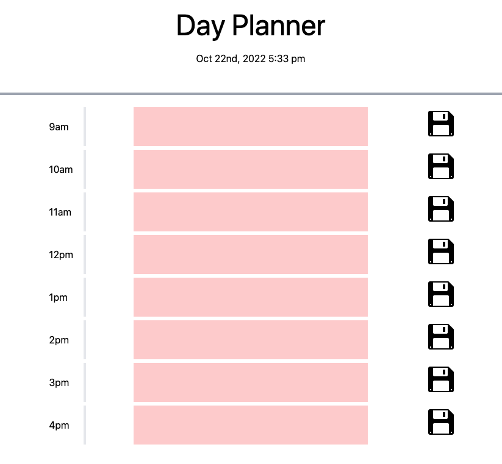

# Day Planner Built Using JS

For this project I was tasked with building a day planner with timed elements that update dynamically based on past, present or future. I chose to build the entirety of the HTML in one page rather than dynamically through JS as all of the elements are static, just the text of elements in the page changes. Also, I went through the processes of installing Node and Tailwind directly into the  project rather than using third party css or vanilla(yuck!). The most challenging aspect for me was dyncamically storing items in the local storage, and then retrieving them with a dynamic process flow as well. The final version does so by completing two loops over the input area based on button clicks or page reload. The webpage can be reached [here.](https://ajaws2022.github.io/Stuff-Things-Times-Tracker/) And an example image of the site is below!
